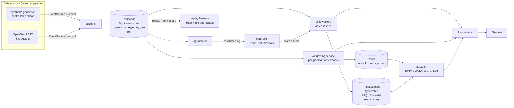
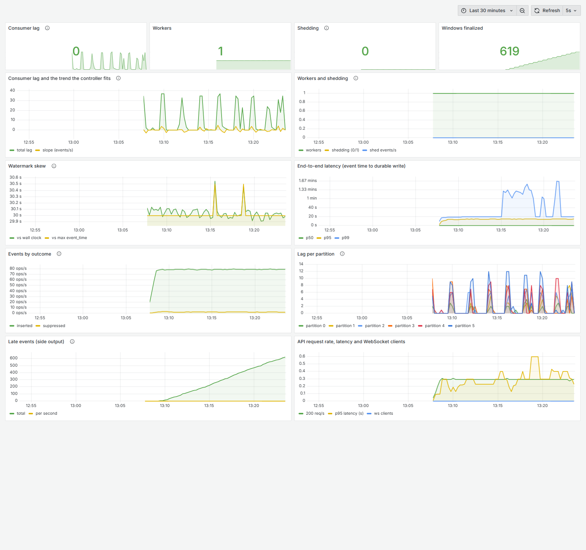

# Contrail

An event-time stream processor for flight telemetry: ADS-B state vectors flow through Redpanda into
windowed aggregates, with a lag-driven control loop that scales and sheds under load, and a replay
harness that proves the whole thing is deterministic.

Built to demonstrate three specific claims, each measured rather than asserted. Every number below
came from a run on the machine described in [BENCHMARKS.md](BENCHMARKS.md), and every one is
reproducible with a command printed beside it there.

---

## The three claims

### 1. Event-time windowing with watermarks beats a processing-time baseline

Both processors run over the *identical* event stream and are scored against ground truth computed
from that same stream. At an allowed-lateness bound equal to the maximum arrival skew:

| disorder | events misplaced, naive | events misplaced, watermark |
|---|---|---|
| low (5s skew) | 0.18% | **0.00%** |
| medium (20s skew) | 3.06% | **0.00%** |
| high (45s skew) | 13.66% | **0.00%** |

**12,049 of 88,199 events filed into the wrong window by the baseline; zero by the watermark
engine** — exactly correct, not within tolerance. Worst single window off by 18 aircraft.

The property behind it is testable as an equality: `allowed_lateness >= max arrival skew` implies the
output is *identical* to ground truth, and error appears only as the bound tightens below the skew.
Events that miss their window even so are not dropped — they go to a counted, logged side output.
Under the harshest configuration that is 15,945 silent misfilings by the baseline against **0**.

### 2. A lag-trend controller keeps up where a static pool does not

Same 6x burst run twice — once with the pool pinned, once adaptive. Both arms run the controller and
the same lag sampler; only one applies its decisions, so the gap is adaptation, not instrumentation.

| | static (1 worker) | adaptive (1-4) |
|---|---|---|
| events absorbed | 75.9% | **100%** |
| peak lag | 33,480 | **10,780** |
| final lag | **14,660 — never recovered** | **0** |
| p95 latency | 112.80s | **17.71s** |
| p99 latency | 115.50s | **21.96s** |

The headline is not the ratio: it is that the static arm **never recovers**. A minute after the burst
it was still 14,660 events behind with a quarter of the load unprocessed.

The controller acts on the *trend* in lag, not a threshold, and requires that trend to be
statistically distinguishable from noise before acting — an earlier version scaled up three times and
shed on a flat, noisy lag series. See [DESIGN_DECISIONS.md](DESIGN_DECISIONS.md) §1.4.

### 3. Replay is deterministic, including across a crash

| check | result |
|---|---|
| 3 replays of one 9,321-message recording | **identical SHA-256 digest** |
| replay `SIGKILL`ed mid-stream, restarted | **digest matches the uninterrupted run** |
| same events over 1 Kafka partition vs 6 | **identical digest** |
| repeated 3x | no flakes |

A replay is a pure function of the recorded topic, so a crash costs progress and nothing else — there
is no partial state to reconcile. Paired with the sink's database-enforced idempotency (a `SIGKILL`ed
consumer restarts and lands on the exact unique row count, zero duplicates), the pipeline is
crash-safe at both ends: **writes are idempotent, reads are reproducible.**

---

## Architecture



Redis is the seam between the pipeline and the API: the API never joins the Kafka consumer group, so
scaling it cannot steal partitions from the pipeline.



---

## Quickstart

```bash
docker compose up -d          # everything, including a live self-demonstrating pipeline
```

That brings up Redpanda, TimescaleDB, Redis, the API, the windowing service, the adaptive pipeline,
a synthetic generator, Prometheus and Grafana.

| what | where |
|---|---|
| Grafana dashboard | http://localhost:3000 (anonymous viewer) |
| Prometheus | http://localhost:9090 |
| API health | http://localhost:8000/healthz |
| API docs | http://localhost:8000/docs |

```bash
# get a token, read the current window aggregates
TOKEN=$(curl -s -X POST localhost:8000/auth/login -H 'Content-Type: application/json' \
  -d '{"username":"operator","password":"contrail"}' | jq -r .access_token)
curl -s localhost:8000/api/windows -H "Authorization: Bearer $TOKEN" | jq

# switch to the live OpenSky feed -- no code change
SOURCE=opensky docker compose up -d generator
```

### Reproducing the claims

```bash
docker compose run --rm --no-deps tests python -m scripts.benchmark_windowing   # claim 1
docker compose run --rm --no-deps api   python -m scripts.benchmark_control     # claim 2
docker compose run --rm tests pytest -q tests/integration/test_replay_determinism.py  # claim 3
BURST_RATE=12 bash scripts/chaos_kill.sh 45                                     # chaos test
docker compose run --rm tests pytest -q                                         # full suite
```

---

## What this is and is not

**The synthetic generator is the primary source, and that is deliberate.** Every benchmark above runs
against it, because its disorder is *controllable* — out-of-order probability, arrival skew,
duplicate rate, late-arrival delay and drop rate are all configuration, so a claim like "exactly
correct when the lateness bound covers the skew" can be stated as an equality and tested. You cannot
do that against a live feed, because you cannot ask the real world for 45 seconds of skew on demand.

**The OpenSky adapter is real and optional.** It ran for 5.5 minutes during development and stored
22,702 rows from 1,166 genuine aircraft; it implements the same `EventSource` protocol, so nothing
downstream knows which source is running. It is the reality check, not the measurement instrument.

Known limitations, all documented in full in [DESIGN_DECISIONS.md](DESIGN_DECISIONS.md):

- **Idle partitions stall the watermark.** With per-partition watermarks the global watermark is the
  minimum across partitions, so a partition that stops delivering halts window finalization. Every
  partition carries traffic under synthetic load, so it does not bite here. The fix needs a
  wall-clock idleness timeout, which would put non-determinism into the processor claim 3 depends on.
- **Live data concentrates in four geographic cells** under the default bounding box, so partition
  balance measured on worldwide synthetic traffic does not transfer to a regional live feed.
- **Load shedding is not exercised by the claim-2 benchmark** — four workers absorb that burst
  outright. Shedding is evidenced by the Phase 1.4 integration run instead, and BENCHMARKS.md says so
  rather than implying the benchmark covers it.
- **Under a sustained 6x burst the pipeline stabilises lag rather than clearing it.** Bounded, not
  unbounded, which is the design intent — but it is not "full recovery under sustained overload".
- The API load-test figures at 100 users are CPU-bound on a two-core laptop running the entire stack
  plus the load generator; the 20-user column is the honest latency measure.

## Layout

```
src/ingestor/    synthetic + OpenSky sources, publisher, idempotent sink
src/windowing/   naive baseline, watermark engine, live service, shared aggregates
src/control/     lag monitor, trend controller, worker supervisor
src/replay/      determinism harness
src/api/         FastAPI, JWT, token-bucket rate limiting
scripts/         the three benchmarks, the chaos test, the Phase 0 report
ops/             Prometheus config, Grafana provisioning + dashboard JSON
```

- [DESIGN_DECISIONS.md](DESIGN_DECISIONS.md) — every non-obvious choice, the alternative considered,
  and why it lost. Including the ones that were wrong first.
- [BENCHMARKS.md](BENCHMARKS.md) — every number above, with the exact configuration and machine that
  produced it.
